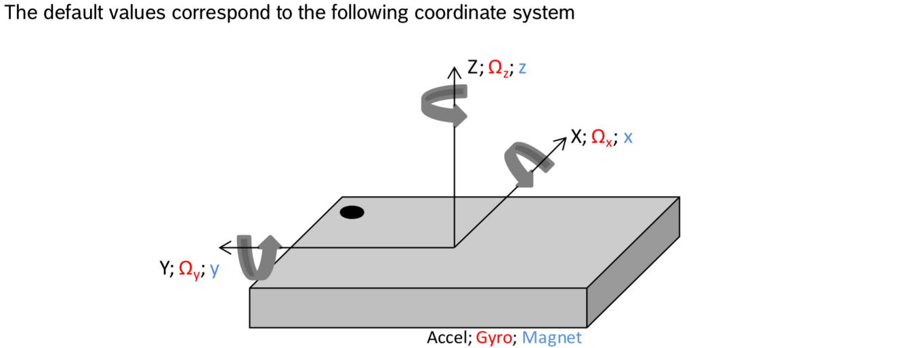

# BNO055_ROS
## Build Procedure
### Build `pi-bno055`
As this ROS package builds upon the CMake project `pi-bno055`, this dependency must be first built, installed and packaged, details see [pi_bno055](https://github.com/lenardxu/HandTracker/tree/main/utils/pi_bno055). To do so, please first assure that you place the dependent CMake project parallel to `cam_imu_ws` under the same directory as it is, as this ROS package is built upon such relative file locations.

### Install IMU tools for RVIZ Visualization
As the tool `rviz_imu_plugin` from [repo](https://github.com/CCNYRoboticsLab/imu_tools) is used for RVIZ visualization of IMU data trajectory, it needs to be installed as follows:
```shell
$ sudo apt-get install ros-<YOUR_ROSDISTO>-imu-tools
```

### Integrate Package `Matplot++` for (Offline) Data Visualization
Since this package also incorporates the functionality of data visualization via the package `Matplot++` provided by the [repo](https://github.com/alandefreitas/matplotplusplus), a convenient way to integrate this tool is to directly add it as a sub-(CMake)-project of the current one. So, you need to clone the whole project
```shell
git clone https://github.com/alandefreitas/matplotplusplus/
```
and place it under this project's root directory.
#### Install `gnuplot`
`gnuplot` is essential for plotting by `Matplot++`.
```shell
$ sudo apt update && sudo apt-get -y install gnuplot
```

### Build `bno055_ros`
Upon that, it's then necessary to build this package as follows:
```shell
# navigate to the workspace root dir, i.e., .../cam_imu_ws

# Variation 1: Build all existing packages under cam_imu_ws
$ catkin_make 


# Variation 2: Only build this package bno055_ros
$ catkin_make --only-pkg-with-deps bno055_ros
# to switch back to mode of building all packages
$ catkin_make -DCATKIN_WHITELIST_PACKAGES=""
```

After successful building, it's time to use `pi-bno055` & `bno055_ros` to systematically configure BNO055.
## Procedure of Using `bno055_ros` for Sending Imu Messages & Determining Axis upon `pi-bno055`
Each time when BNO055 is powered on, it starts in RESET mode. Therefore, the following procedure is to be taken:

* Use `getbno055_tool` of project `pi_bno055` for configuration of sensor (make sure it's already successfully built, installed and packaged, details see [pi_bno055](https://github.com/lenardxu/HandTracker/tree/main/utils/pi_bno055))
  * Navigate to dir where `getbno055_tool` is located, i.e., `.../pi_bno055/install/bin/pi_bno055`
  * ```shell
    # check if self-test passes by checking status of "Accelerometer Test", "Magnetometer Test", "Gyroscope Test", "MCU Cortex M0 Test", "Power Mode". Only when it passes, proceed. If not, try again.
    $ ./getbno055_tool -t inf
    # set unit selection as rosw (units: m/s2, rps; data output format: Windows)
    # and set sensor to desired fusion mode, e.g., as NDOF_FMC, that is essential for following calibration and formal use
    $ ./getbno055_tool -u rosa -m ndof_fmc
    # check if it is set successfully, if not, try above again according to the failed one
    $ ./getbno055_tool -t inf
    ```
  * Perform calibration - see "section 3.10 Calibration" for concrete procedure of respective sensor or refer to [this useful video](https://community.bosch-sensortec.com/t5/MEMS-sensors-forum/BNO055-System-Calibration/td-p/7551). As a result, when you check the result using `$ ./getbno055_tool -t inf`, there should be
    ```shell
      Sensor System Calibration = Fully calibrated
          Gyroscope Calibration = Fully calibrated
      Accelerometer Calibration = Fully calibrated
       Magnetometer Calibration = Fully calibrated
    ```
  * Save the resulting calibration data to local host using
    ```shell
    $ ./getbno055_tool -w bno.cfg
    # Check the results after calibration. first navigate to where bno.cfg is, i.e., .../pi_bno055/
    $ ls -l bno.cfg
    $ od -A x -t x1 -v bno.cfg
    ```
    , the resulting calib file will be saved in the root dir of `pi_bno055`. Afterwards, it can be used for loading in other project.
  * Copy this calib file to the config dir under root directory of this project, i.e., `.../bno055_ros/config/`
* Don't power off BNO055 before using `bno055_ros` (this package). Otherwise, the sensor is reset after rebooting, which requires the above steps again.
* Use `bno055_ros` (this package) for checking the necessity of axis remapping
  * ```shell
    # navigate to the root dir of cam_imu_ws and then command
    $ source devel/setup.bash
    # launch the node
    $ roslaunch bno055_ros bno055_ros.launch
    ```
  * Right after launching the node `bno055_pub_node`, move the sensor along its shorter side in parallel. The resulting Imu data is saved locally.
  * Repeat the above two steps but with switching the sensor motion to longer side one. The resulting Imu data is saved locally.
  * Draw both these trajectory based on Imu data to see to which two coordinate axes these two sides correspond, under default axis remap (See the following snapshot and [section 3.4](https://www.bosch-sensortec.com/media/boschsensortec/downloads/datasheets/bst-bno055-ds000.pdf) for more details). Given the sensor coordinate system is right-handed, the third axis can be inferred.
    
    

> ℹ️ Each time when BNO055 is powered on, it is reset. That means, you have to perform the steps above again after rebooting BNO055, including setting unit selection, fusion mode and performing calibration and etc.

> ℹ️ Calibration Data is individual for every unit.


## General description of package `bno055_ros`
This stand-alone package exists for the following primary purposes:
* Axis determination of BNO055 under default configuration for purpose of the potentially necessary re-configuration of device axis in case of mounting sensor other than default placement.
  * For that, the offline data visualization functionality is accessible. The procedure is as follows: 
    * First use `bno055_ros.launch`: Publish Imu message stream whilst recording (`bno055_pub_node`) and meanwhile subscribe to it for saving `bno055_sub_node`. 
    * Then use `plot_imu_data.launch`: Plot linear acceleration, angular rate and absolute orientation upon local data (`plot_imu_data_node`).
* Publishing Imu data specifically for computing Allan Variance parameters.
  * Use `bno055_ros.launch`: Publish Imu message stream whilst recording (`bno055_pub_node`). Details see subsection "Preparations for Satisfying Requirements" of [README of oakd_bno055_ros](https://github.com/lenardxu/HandTracker/blob/main/utils/cam_imu_ws/src/oakd_bno055_ros/README.md).
* Visualization of absolute orientation via RVIZ.
  * Use `bno055_ros.launch`: Only `bno055_sub_node` is not used.

The design of this package for its independence from `oakd_bno055_ros` is to keep itself clean in terms of its use on one hand and to keep the main implementation of `oakd_bno055_ros` clear to user on the other hand.

| Node | Source Files | Topics & Messages | Description
| ----------- | ----------- | ----------- | ----------- |
| `bno055_pub_node` | src/bno055_pub_node.cpp <br /> src/bno055_pub.cpp <br /> src/bno055_utils.cpp | `/sensors/imu` & `sensor_msgs::Imu` | publish Imu message (fused data) |
| `imu_tf_broadcaster_node` | src/imu_tf_broadcaster.cpp | `/sensors/imu` & `sensor_msgs::Imu` | tf broadcast Imu message for visualization via RVIZ |
| `bno055_sub_node` | src/bno055_sub_node.cpp <br /> src/bno055_sub.cpp | `/sensors/imu` & `sensor_msgs::Imu` | subscribe to Imu message and store it locally (e.g. for offline visualization by `plot_imu_data_node`)|
| `plot_imu_data_node` | src/plot_imu_data_node.cpp <br /> src/plot_imu_data.cpp | None | plot the Imu data stored locally |


If unit requires calibration, attempt to read it from calibration file, which should be located in the `.../bno055_ros/config` directory. 
Run any fusion mode available as you want by setting the `opr_mode` in the config file `bno055_pub.yaml`.

The visualization of Imu data via RVIZ takes use of the RVIZ plugin tool provided by `rviz_imu_plugin` in 
[the repo](https://github.com/CCNYRoboticsLab/imu_tools) and plane model and specific RVIZ configuration provided in [the repo](https://github.com/bandasaikrishna/orientations_from_IMU_MPU_6050).

## Troubleshooting
* `[ERROR] [1660644993.504893469]: NDOF fusion mode requires calib status of 255. Please calibrate and try again.`
    <details>
      <summary>Longer explanation</summary>
  
    This kind of error when launching node `bno055_ros_node` may take place when the sensor is not fully calibrated w.r.t. calibration status to the system and all sensors. Solution: according to which sensor or system is not fully calibrated, move the sensor in such motion corresponding to its own calibration motion suggestion. Then check if it succeeds by using `./getbno055_tool -t inf`
  </details>


