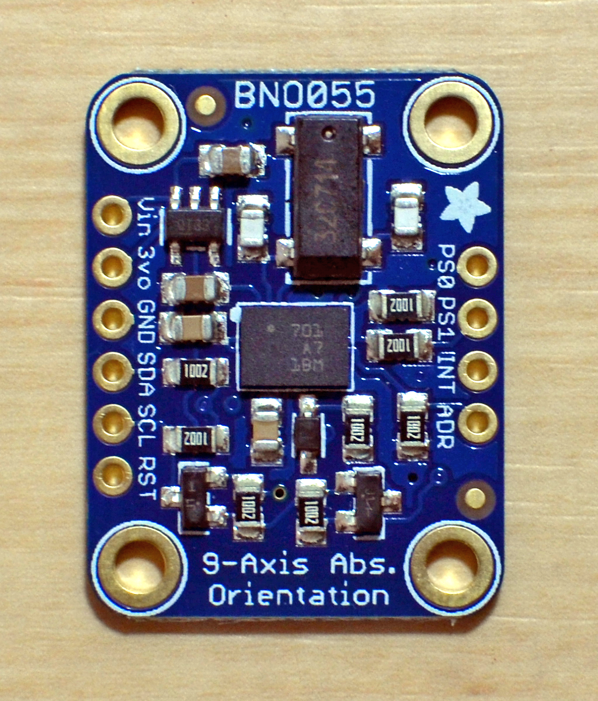
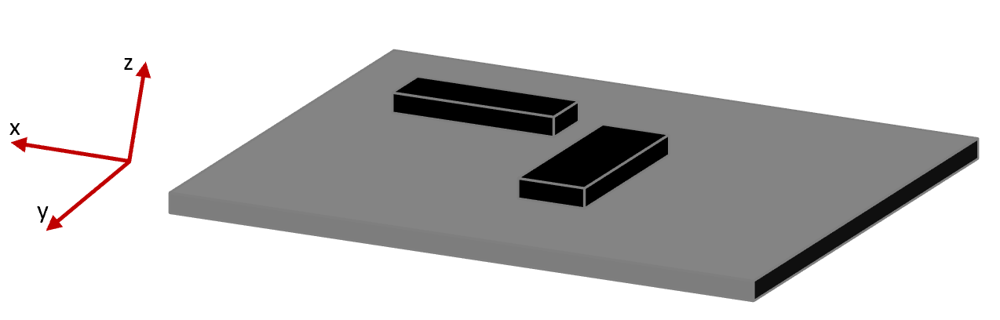

# pi_bno055


## Background
This is a C driver program for operating a Bosch BNO055 (Adafruit) IMU sensor via I2C on a Raspberry Pi (4 model B). It should also apply to Raspberry Pi 3.



## I2C bus connection
For I2C communication functions, I am using the i2c-tools and i2c-dev packages.

```shell
$ sudo apt-get install -y i2c-tools libi2c-dev
```
Now we can use the i2cdetect command to query the I2C bus.  Connecting the Adafruit-BNO055 sensor to the Raspberry Pi I2C bus (hardware version), the sensor responds with the slave address 0x28. 


```shell
# By default, use 'i2cdetect -y 1'; When using software I2C, command the following
$ i2cdetect -y 3
     0  1  2  3  4  5  6  7  8  9  a  b  c  d  e  f
00:          -- -- -- -- -- -- -- -- -- -- -- -- --
10: -- -- -- -- -- -- -- -- -- -- -- -- -- -- -- --
20: -- -- -- -- -- -- -- -- 28 -- -- -- -- -- -- --
30: -- -- -- -- -- -- -- -- -- -- -- -- -- -- -- --
40: -- -- -- -- -- -- -- -- -- -- -- -- -- -- -- --
50: -- -- -- -- -- -- -- -- -- -- -- -- -- -- -- --
60: -- -- -- -- -- -- -- -- -- -- -- -- -- -- -- --
70: -- -- -- -- -- -- -- --
```

## Code compilation, installation and packaging
It's first recommended to use CMake of version higher than 3.15 for sake of convenient installation.

```shell
# navigate to root directory, i.e., ./pi_bno055
$ mkdir build && cd build
$ cmake ..
$ cmake --build .
# To acquire a clean set of targets; before cmake 3.15, use "make install"
# use self-defined install prefix instead of default one, i.e., /usr/local/ under Linux
# To use cmake --install, you have to assure the cmake version is at least 3.15
$ cmake --install . --prefix "path-of-install-dir-under-project-dir" # e.g., cmake --install . --prefix "/home/ubuntu/VO/HandTracker/utils/pi_bno055/install"

# otherwise when less than 3.15, try
$ cmake -DCMAKE_INSTALL_PREFIX="path-of-install-dir-under-project-dir" .. # e.g., cmake -DCMAKE_INSTALL_PREFIX="/home/ubuntu/VO/HandTracker/utils/pi_bno055/install"
$ cmake --build . --target INSTALL
```
As a result, the executable (named `getbno055_tool`) and lib (named `getbno055` as static) are installed for eg as follows:
```shell
-- Install configuration: ""
-- Installing: /home/ubuntu/VO/HandTracker/utils/pi_bno055/install/bin/pi_bno055/getbno055_tool
-- Installing: /home/ubuntu/VO/HandTracker/utils/pi_bno055/install/include/pi_bno055/pi_bno055Config.h
-- Installing: /home/ubuntu/VO/HandTracker/utils/pi_bno055/install/lib/pi_bno055/cmake/getbno055/getbno055.cmake
-- Installing: /home/ubuntu/VO/HandTracker/utils/pi_bno055/install/lib/pi_bno055/cmake/getbno055/getbno055-noconfig.cmake
-- Installing: /home/ubuntu/VO/HandTracker/utils/pi_bno055/install/lib/pi_bno055/cmake/getbno055/getbno055Config.cmake
-- Installing: /home/ubuntu/VO/HandTracker/utils/pi_bno055/install/lib/pi_bno055/cmake/getbno055/getbno055ConfigVersion.cmake
-- Installing: /home/ubuntu/VO/HandTracker/utils/pi_bno055/install/lib/pi_bno055/libgetbno055.a
-- Installing: /homeubuntu/VO/HandTracker/utils/pi_bno055/install/include/pi_bno055/getbno055.h
```
Upon that, you can either use the `getbno055_tool` to interface with BNO055 and use `getbno055` for projects depending on it.

> ℹ️ To solve the [hardware I2C clock stretching bug/problem in RPI](https://github.com/raspberrypi/linux/issues/4884), the corresponding solution is taken, i.e., to use software I2C rather than the flawed build-in hardware. Consequently, the new I2C bus called `/dev/i2c-3` is active rather than the old `/dev/i2c-1`. So, the macro `I2CBUS` defined in `getbno055.h` is set as `/dev/i2c-3`. If you'd apply other solutions sticking around the old I2C bus, don't forget to change the value of `I2CBUS` back to `/dev/i2c-1`. More details see the second approach in `Wiring` section of [Set up Camera IMU System](https://gitlab.com/telekinesis-ai/visual-odometry/visual-odometry/-/blob/feature/svo_ros/docs/camera_imu_system.md).

## Example output

Finding the executable `getbno055_tool` (for eg, under `.../pi_bno055/install/bin/pi_bno055/`) and running the program, extracting the sensor version and configuration information:
```shell
$ ./getbno055_tool -t inf

BN0055 Information at Mon Aug 15 13:51:58 2022
----------------------------------------------
   Chip Version ID = 0xA0
  Accelerometer ID = 0xFB
      Gyroscope ID = 0x0F
   Magnetoscope ID = 0x32
  Software Version = 3.17
   Operations Mode = NDOF_FMC
        Power Mode = NORMAL                                          #Comment: must be NORMAL for operation mode other than CONFIG
Axis Configuration = X==X Y==Y Z==Z (ENU)
   Axis Remap Sign = X+ Y+ Z+
System Status Code = Sensor running with fusion algorithm
System Clocksource = Internal Clock (default)                        #Comment: unless connected to an external 32 KHz crystal oscillator, Internal Clock is used
Accelerometer Test = OK                                              #Comment: must be OK
 Magnetometer Test = OK                                              #Comment: must be OK
    Gyroscope Test = OK                                              #Comment: must be OK
MCU Cortex M0 Test = OK                                              #Comment: must be OK
 System Error Code = No Error
Acceleration Unit  = m/s2                                            #Comment: required by ROS Imu
    Gyroscope Unit = rps                                             #Comment: required by ROS Imu
        Euler Unit = Degrees
  Temperature Unit = Celsius
  Orientation Mode = Windows
Sensor Temperature = 29°C

----------------------------------------------
Accelerometer  Power = NORMAL
Accelerometer Bwidth = 62.5Hz
Accelerometer GRange = 2G                                            #Comment: desired since the max. mean acc of hand motion is about 6m/s^2
Accelerometer  Sleep = event-driven, 0.5ms

----------------------------------------------
Sensor System Calibration = Fully calibrated                         #Comment: required by NDOF_FMC / NDOF_FMC_OFF
    Gyroscope Calibration = Fully calibrated                         #Comment: required by NDOF_FMC / NDOF_FMC_OFF
Accelerometer Calibration = Fully calibrated                         #Comment: required by NDOF_FMC / NDOF_FMC_OFF
 Magnetometer Calibration = Fully calibrated                         #Comment: required by NDOF_FMC / NDOF_FMC_OFF
```

Running the program, showing the sensor calibration state and offset values:
```shell
$ ./getbno055_tool -t cal
sys [S:3] acc [S:1 X:0 Y:65534 Z:65528 R:1000] mag [S:3 X:65428 Y:65424 Z:65476 R:656] gyr [S:3 X:65534 Y:0 Z:1]
```

Changing the operational mode, e.g. to CONFIG:
```shell
$ ./getbno055_tool -v -m config
Debug: arg -s, value config
Debug: ts=[1539005771] date=Mon Oct  8 22:36:11 2018
Debug: Sensor Address: [0x28]
Debug: Write opr_mode: [0x00] to register [0x3D]
```

Resetting the sensor:
```shell
$ ./getbno055_tool -v -r
Debug: arg -r, value (null)
Debug: ts=[1539005864] date=Mon Oct  8 22:37:44 2018
Debug: Sensor Address: [0x28]
Debug: BNO055 Sensor Reset complete
```

NDOF fusion mode, Euler angles
```shell
$ ./getbno055_tool -t eul
EUL 233.00 -3.12 -15.94
# output Imu data out of GYR, EUL, QUA and LIN in sampled way (2hz)
$ ./getbno055_tool -t imu_sp
GYR 0.00 0.00 0.00; EUL 78.5625 -0.9375 -6.0000; QUA 0.77 -0.04 0.04 -0.63; LIN -0.07 0.03 -0.02
Sensor reading took 0.003071 seconds 
GYR 0.00 0.00 -0.00; EUL 78.5625 -0.9375 -6.0000; QUA 0.77 -0.04 0.04 -0.63; LIN -0.07 0.04 -0.01
Sensor reading took 0.002521 seconds 
GYR -0.00 -0.00 0.00; EUL 78.5625 -0.9375 -6.0000; QUA 0.77 -0.04 0.04 -0.63; LIN -0.08 0.03 -0.03
Sensor reading took 0.005492 seconds 
GYR 0.00 0.00 -0.00; EUL 78.5625 -0.9375 -6.0000; QUA 0.77 -0.04 0.04 -0.63; LIN -0.08 0.02 -0.03
Sensor reading took 0.003621 seconds 
GYR 0.00 -0.00 0.00; EUL 78.5625 -0.9375 -6.0000; QUA 0.77 -0.04 0.04 -0.63; LIN -0.07 0.03 -0.02
Sensor reading took 0.002558 seconds 
GYR -0.00 0.00 -0.00; EUL 78.5625 -0.9375 -6.0000; QUA 0.77 -0.04 0.04 -0.63; LIN -0.07 0.02 -0.01
Sensor reading took 0.002552 seconds 
GYR 0.00 0.00 0.00; EUL 78.5625 -0.9375 -6.0000; QUA 0.77 -0.04 0.04 -0.63; LIN -0.06 0.02 0.02
Sensor reading took 0.002575 seconds
```

Writing calibration data to file
```shell
$ ./getbno055_tool -t cal
sys [S:3] acc [S:1 X:0 Y:65534 Z:65528 R:1000] mag [S:3 X:65428 Y:65424 Z:65476 R:656] gyr [S:3 X:65534 Y:65535 Z:1]

$ ./getbno055_tool -w bno.cfg
$ ls -l bno.cfg
-rw-rw-r-- 1 pi pi 22 Nov 11 14:17 bno.cfg

$ od -A x -t x1 -v bno.cfg
000000 00 00 fe ff f8 ff 94 ff 90 ff c4 ff fe ff ff ff
000010 01 00 e8 03 90 02
000016
```
## Usage

Program usage:
```shell
$ ./getbno055_tool
Usage: getbno055 [-a hex i2c-addr] [-c 2g|4g|8g|16g] [-m <opr_mode>] [-t acc|gyr|mag|eul|qua|lin|gra|inf|imu|imu_sp|cal|con] [-u rosa | rosw] [-r] [-q] [-w calfile] [-l calfile] [-o htmlfile] [-v]

Command line parameters have the following format:
   -a   sensor I2C bus address in hex, Example: -a 0x28 (default)
   -b   I2C bus to query, Example: -b /dev/i2c-1 (default)
   -c   set sensors configuration params (only acc_range now) (For SW Version 3.17, even G Range is auto controlled in fusion mode.)
           2g
           4g
           8g
           16g
   -d   dump the complete sensor register map content
   -m   set sensor operational mode. mode arguments:
           config   = configuration mode
           acconly  = accelerometer only
           magonly  = magnetometer only
           gyronly  = gyroscope only
           accmag   = accelerometer + magnetometer
           accgyro  = accelerometer + gyroscope
           maggyro  = magetometer + gyroscope
           amg      = accelerometer + magnetometer + gyroscope
           imu      = accelerometer + gyroscope fusion -> rel. orientation
           compass  = accelerometer + magnetometer fusion -> abs. orientation
           m4g      = accelerometer + magnetometer fusion -> rel. orientation
           ndof     = accelerometer + mag + gyro fusion -> abs. orientation
           ndof_fmc = ndof, using fast magnetometer calibration (FMC)
   -p   set sensor power mode. mode arguments:
          normal    = required sensors and MCU always on (default)
          low       = enter sleep mode during motion inactivity
          suspend   = sensor paused, all parts put to sleep
   -u   set the unit and data output format:
          rosa      = ros specific unit selection of accel and gyro measure (m/s^2 & rad/s) in Android orientation 
          rosw      = ros specific unit selection of accel and gyro measure (m/s^2 & rad/s) in Windows orientation 
   -r   reset sensor
   -q   close I2C bus communication (no effect on sensor params)
   -t   read and output sensor data. data type arguments:
           acc = Accelerometer (X-Y-Z axis values)
           gyr = Gyroscope (X-Y-Z axis values)
           mag = Magnetometer (X-Y-Z axis values)
           eul = Orientation E (H-R-P values as Euler angles)
           qua = Orientation Q (W-X-Y-Z values as Quaternation)
           gra = GravityVector (X-Y-Z axis values)
           lin = Linear Accel (X-Y-Z axis values)
           imu = Gyro+Euler+Quaternion+LinearAccel
           imu_sp = Gyro+Euler+Quaternion+LinearAccel in sampled output (0.5s)
           inf = Sensor info (23 version and state values)
           cal = Calibration data (mag, gyro and accel calibration values)
           con = Continuous data (eul)
   -l   load sensor calibration data from file, Example -l ./bno055.cal
   -w   write sensor calibration data to file, Example -w ./bno055.cal
   -o   output sensor data to HTML table file, requires -t, Example: -o ./bno055.html
   -h   display this message
   -v   enable debug output

Note: The sensor is executing calibration in the background, but only in fusion mode.

Usage examples:
./getbno055 -a 0x28 -t inf -v
./getbno055 -t cal -v
./getbno055 -t eul -o ./bno055.html
./getbno055 -m ndof
./getbno055 -w ./bno055.cal
```

The sensor register data can be dumped out with the "-d" argument:
```shell
$ ./getbno055_tool -d
------------------------------------------------------
BNO055 page-0:
------------------------------------------------------
 reg    0  1  2  3  4  5  6  7  8  9  A  B  C  D  E  F
------------------------------------------------------
[0x00] A0 FB 32 0F 11 03 15 00 71 FF B1 00 B5 03 44 FE
[0x10] FB 32 0F 11 03 15 00 71 FF B1 00 B5 03 44 FE BE
[0x20] 32 0F 11 03 15 00 71 FF B1 00 B5 03 44 FE BE 02
[0x30] 0F 11 03 15 00 71 FF B1 00 B5 03 44 FE BE 02 6A
[0x40] 11 03 15 00 6F FF B1 00 C2 03 44 FE BE 02 6A FD
[0x50] 03 15 00 6F FF B1 00 C2 03 44 FE BE 02 6A FD FE
[0x60] 15 00 6F FF B1 00 C2 03 44 FE BE 02 6A FD FE FF
[0x70] 00 6F FF B1 00 C2 03 44 FE BE 02 6A FD FF FF FF
------------------------------------------------------
BNO055 page-1:
------------------------------------------------------
 reg    0  1  2  3  4  5  6  7  8  9  A  B  C  D  E  F
------------------------------------------------------
[0x00] 00 03 05 00 0C 00 00 01 0D 6D 38 00 00 00 00 00
[0x10] 03 05 00 0C 00 00 01 0D 6D 38 00 00 00 00 00 00
[0x20] 05 00 0C 00 00 01 0D 6D 38 00 00 00 00 00 00 14
[0x30] 00 0C 00 00 01 0D 6D 38 00 00 00 00 00 00 14 03
[0x40] 0C 00 00 01 0D 6D 38 00 00 00 00 00 00 14 03 0F
[0x50] 00 00 01 0D 6D 38 00 00 00 00 00 00 14 03 0F C0
[0x60] 00 01 0D 6D 38 00 00 00 00 00 00 14 03 0F C0 0A
[0x70] 01 0D 6D 38 00 00 00 00 00 00 14 03 0F C0 0A 0B
```

## Calibration
Instruction on calibration can be referred to in section `3.11 Calibration` in the [Datasheet](https://www.bosch-sensortec.com/media/boschsensortec/downloads/datasheets/bst-bno055-ds000.pdf) of BNO055.

And an official tutorial video about how to calibrate BNO055:

[](https://www.youtube.com/watch?v=Bw0WuAyGsnY "cal")

## Left-/Right-handed Coordinate System
The BNO055 is a right-handed coordinate system after validation on its linear acceleration and angular rate data along the cardinal three axes. That is not influenced by whether data output format according to android or windows is adopted. That only has an influence on the pitch in euler angle (See section 3.6.2 "Data output format" in the datasheet).
In my case, the device's cardinal axes orientations upon testing look like the following:



## Extensions, Corrections and Refactors
Compared to the code (open-sourced: [pi-bno055](https://github.com/fm4dd/pi-bno055)) for interfacing with BNO055 based 
on I2C communication protocol, the following adaptations are taken for our project.
### Extensions
| Vars & Functions (Fundamental Interfaces with BNO055) | Brief Description                                                                                                                          | Comment |
| ----------- |--------------------------------------------------------------------------------------------------------------------------------------------| ------------ |
| `close_i2cbus()` | close the I2C bus communication                                                                                                            | |
| `get_imu(struct bnogyr*, struct bnoeul*, struct bnoqua*, struct bnolin*)` & corresponding API in main function for outputting Imu data to stdout for debugging/testing | read Imu data out                                                                                                                          | |
| `set_config_mode()` | set to the config operation mode                                                                                                           | |
| `get_acc_with_dt(struct bnoacc *bnod_ptr, long *elapsed_t)` | Get the acc data delay alongside retrieving the acc data by considering the irrelevant time cost in sending trigger signal for retrieval   | |
| `get_gyr_with_dt(struct bnogyr *bnod_ptr, long *elapsed_t)` | Get the acc data delay alongside retrieving the gyr data by considering the irrelevant time cost in sending trigger signal for retrieval   | |
| `get_qua_with_dt(struct bnoqua *bnod_ptr, long *elapsed_t)` | Get the acc data delay alongside retrieving the quat data by considering the irrelevant time cost in sending trigger signal for retrieval  | |
| `set_last_mode(opmode_t)` | set to the config operation mode                                                                                                           | |
| `get_ufactor_()` & `struct bnoufact`| read the unit selection, upon which the unit-specific factors are acquired that are then save in the struct `bnoufact`                     | This can be used in sensor configuration instead of each round when acquiring any Imu data|
| `get_unit()` | get the sensor SI unit configuration, specifically used for downstream project                                                             | |
| `set_unit(int)` | set the sensor SI unit configuration, specifically used for downstream project                                                             | |
| `set_remap(char, int)` | set axis remap config or sign via given character                                                                                          | |
| `enum g_range_t`&`set_acc_conf(g_range_t)` & corresponding API for setting acc conf in `getbno055.c` | set accelerometer config via given enum `g_range_t`                                                                                        | |
| `int set_acc_conf()` | only set the G Range                                                                                                                       | SW Version 3.7 also sets G Range as auto controlled in fusion mode, so no need of this func any more |

More details on description see the functions' comment in source code.

> ℹ️ About getting and setting Gyroscope & Magnetometer configuration params, since they will be auto 
> controlled in fusion mode, the corresponding functions are omitted here.
### Corrections
| Vars & Functions (Fundamental Interfaces with BNO055) | Origin | Corrected |
| ----------- | ------------ | ------------ |
| `I2CBUS` | `#define I2CBUS "/dev/i2c-1"` | `#define I2CBUS "/dev/i2c-3"` |
| `print_unit(int unit_sel)` | `if((unit_sel >> 3) & 0x01)` | `if((unit_sel >> 7) & 0x01)` |
| `set_mode(opmode_t)` | mode switching time | mode switching time changed |
| `set_power(power_t pwrmode)` | `printf("Debug: Write opr_mode: [0x%02X] to register [0x%02X]\n", data[1], data[0]);` | `printf("Debug: Write pwr_mode: [0x%02X] to register [0x%02X]\n", data[1], data[0]);` |
| `get_acc_conf(struct bnoaconf)` | all the bitwise operations are wrong | the correct bitwise operations |
| main func | `calfile` | `calfile_path`, which enables `calfile` to be always in root dir of project|
| All buffer variables holding the Imu data read from the sensor | data type `char` | data type `unsigned char` |
### Refactors
* Project originally built by Makefile is refactored to CMake project and then packaged for downstream projects.
  * `getbno055_tool` as a tool to interface with BNO055 
  * `getbno055` as a package/library for building other projects
  
## TODO
- [x] The operation mode switching time in the original function `set_mode(opmode_t)` w.r.t. "from config to any other"
and "from any other to config" is exactly opposed to the required shown in the `Table 3-6`. However, after multiple tests
on this "suspicious" switching time, it turns out to be fine. Even though, I made the change.
